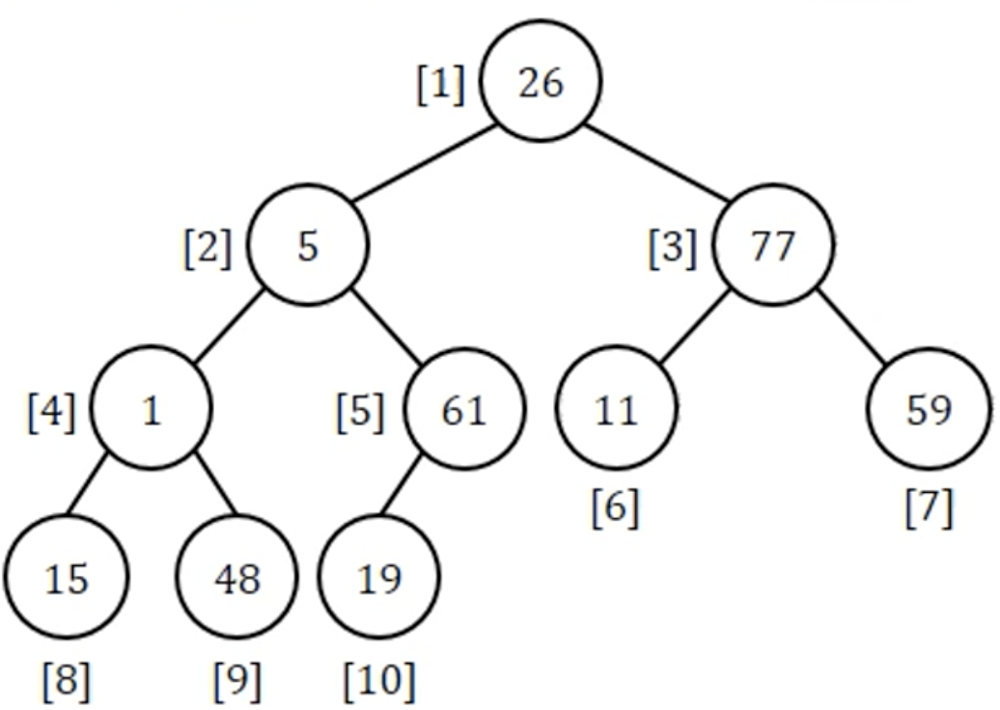
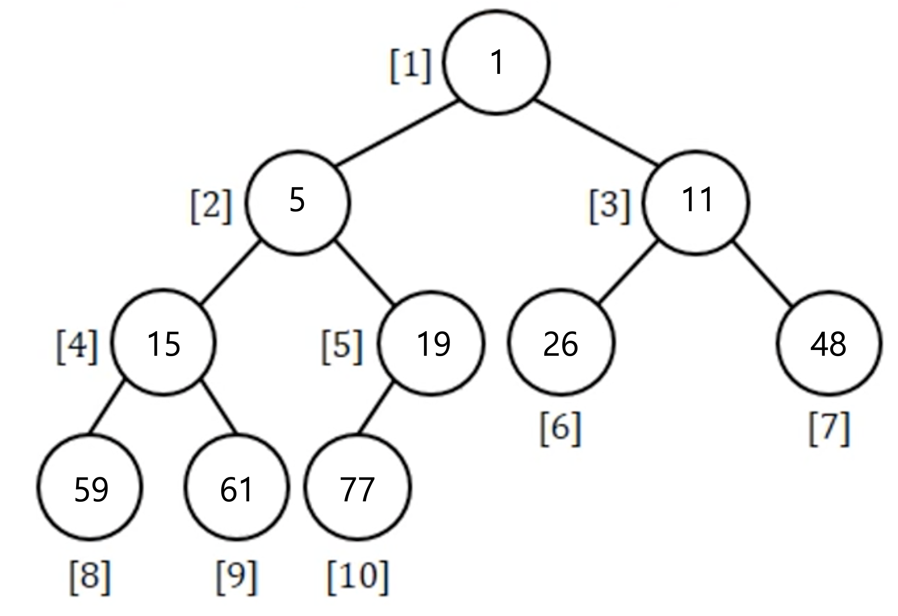
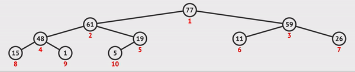
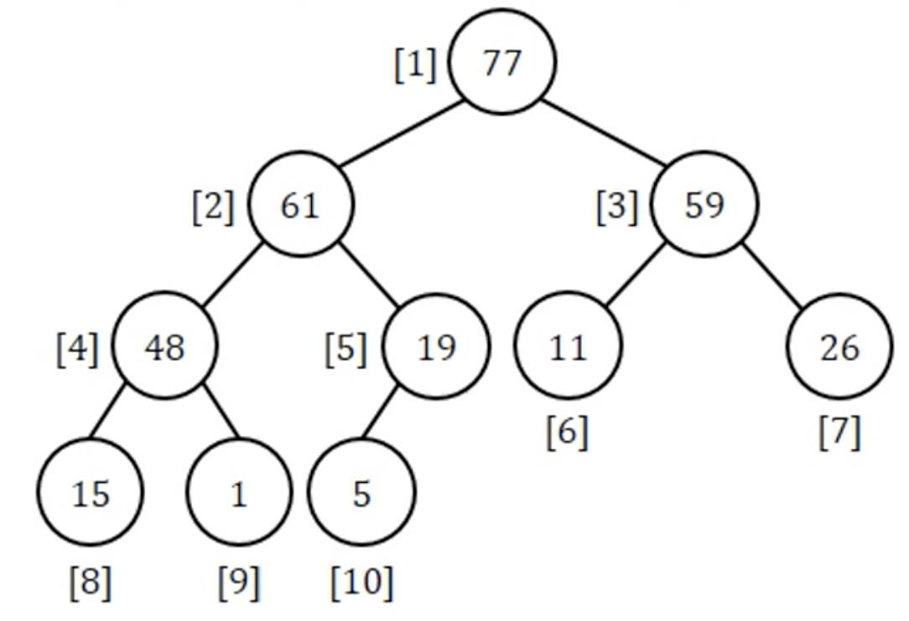
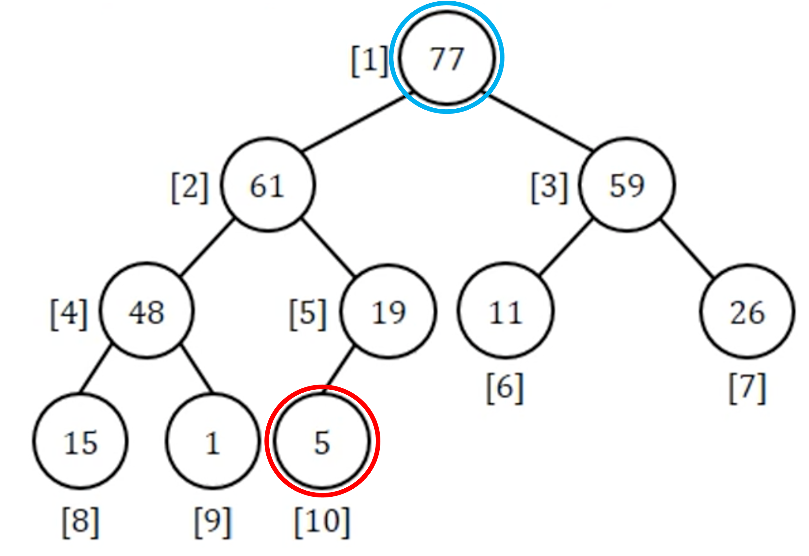
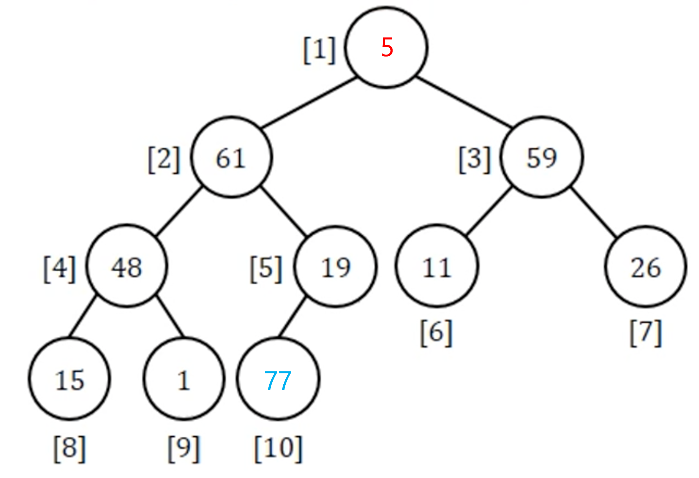
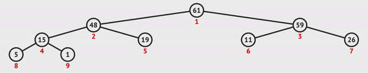
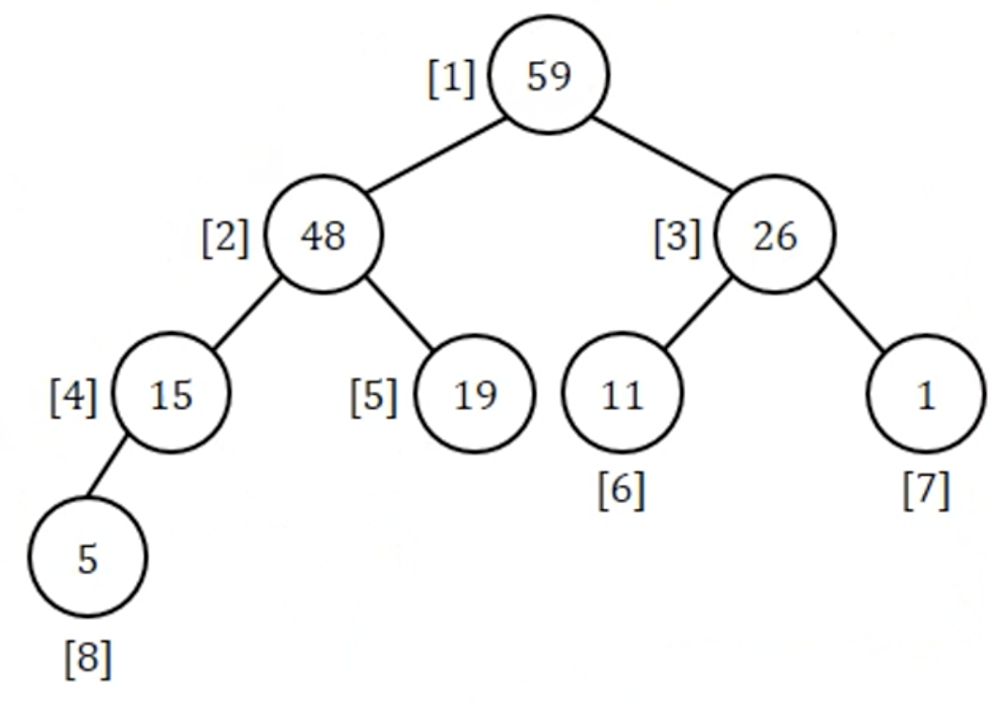
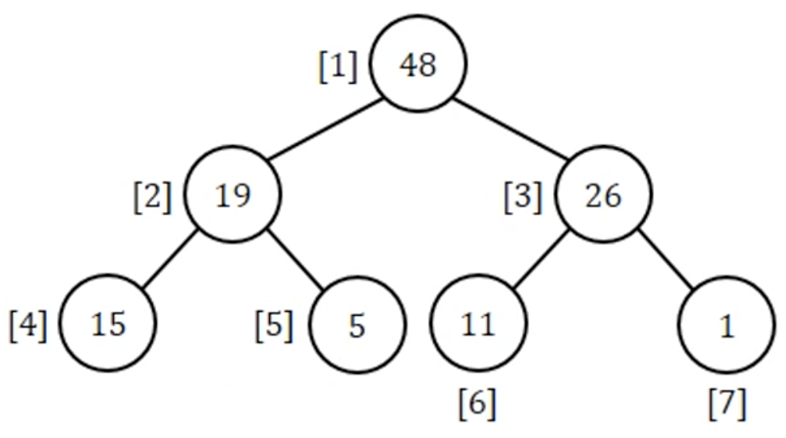

# ❤️ Introduction

Hello Sort!

---

## Selection Sort

## Heap Sort

- An application of Heap

- __Input__ : random array of $n$ numbers

- __Output__ : the array of $n$ sorted numbers

|Input|Output|
|-|-|
|||

- Steps
  - 1️⃣ Heap construction
  - 2️⃣ Swap ___the root___ and ___the rightmost leaf___
  - 3️⃣ <b style="color:red">Adjust</b> the array to satisfy the heap requirements 
  - 4️⃣ Repeat 2️⃣, 3️⃣ until sorting is completed

- Time complexity : $O(nlogn)$

### 1️⃣ Heap construction



|Input|Initial Heap|
|-|-|
|||

1. Make every subtree of height ___2___ a heap
2. Make every subtree of height ___3___ a heap
3. ...
4. Make every subtree of height ___n___ a heap
5. Until the entire tree becomes a heap

### 2️⃣ Swaping

|Choose 1, n|Swap|
|-|-|
|||

- Swap ___the root___ and ___the rightmost leaf___

### 3️⃣ Adjust



- Except for ___the swaped rightmost leaf___, Adjust the tree to satisfy the requirements.
- ___the swaped rightmost leaf___ becomes ___the sorted___ element.

### 4️⃣ Repeat

|💖|1|2|3|...|9 $(=n-1)$|
|-|-|-|-|-|-|
|__Heap__||||...||
|__Sorted[]__|[77]|[61,77]|[59,61,77]|...|[<b style="color:red;">1</b>,5,11,15,19,26,48,59,61,77]|

### 👉 Codes

```C
void heapsort(element a[], int n){
    /* perform a heap sort on a[] */
    int i, j;
    element temp;

    // 1️⃣ Heap construction
    for(i=n/2; i>0; i--)
        adjust(a, i, n);
    
    // 4️⃣ Repeat
    for(i=n-1; i>0; i--) {
        // 2️⃣ Swaping
        SWAP(a[i], a[i+1], temp);
        // 3️⃣ Adjust
        adjust(a, 1, i);
    }
}
```

[`void adjust(element a[], int root, int n)`](../Datastructure/Heap.md#-2-deletev-deequeue)

---