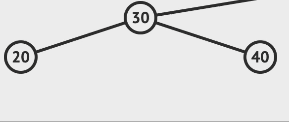

# ❤️ Introduction

- Application of Binary Tree

- Binary Search Tree (BST) is a binary tree in which each node satisfies ___BST property___.
  - All nodes in the <b style="color: red">left subtree</b> of a node must hold a value <b style="color: red">smaller</b> than its own and all nodes in the <b style="color: blue">right subtree</b> of a node must hold a value <b style="color: blue">larger</b> than its own


```C
search - int v
    switch(COMPARE(v, key(root)))
        case '<': search in left subtree
        case '=': found
        case '>': search in right subtree
```

---

## 🧡 ADT

__Definition__ : ___A Binary Search Tree(BST)___ is a binary tree. It may be empty. If it is not empty then it satisfies the following properties.
</br>__(1)__ Each node has exactly one key and the keys in the tree are distinct.
</br>__(2)__ The keys (if any) in the <b style="color: red">left</b> subtree are <b style="color: red">smaller</b> than the key in the root.
</br>__(3)__ The keys (if any) in the <b style="color: blue">right</b> subtree are <b style="color: blue">larger</b> than the key in the root.
</br>__(4)__ The left and right subtrees are also __binary search tree(BST)__.

|💖|operation|discription|
|-|-|-|
|1.|___search(v)___|return the pointer to ___v___ if v exist in BST, if not return NULL|
|2.|___insert(v)___|insert ___v___ into BST at leaf-position that satisfy __BST property__|
|3.|___delete(v)___|delete ___v___ from BST, replace its position with a leaf with key's value closed with ___v___'value ___(successor)___ |

---

## 💛 Representation

### 0. Node

- [Binary Tree](./BinaryTree.md#-0-node)

### 1. search(v)

- Following the BST property, search the tree according to the key of nodes.

  - resursive search

    ```C
    element* search(treePointer root, int k){
        /* return a pointer to the element whose key is k, if there is no such element, return NULL */
        if(!root) 
            return NULL;
        if(k == root->data.key) 
            return &(root->data);
        if(k < root->data.key) 
            return search(root->leftChild, k);
        return search(root->rightChild, k);
    }
    ```

  - iterative search

    ```C
    element* search(treePointer, int k){
        while(tree){
            if(k == tree->data.key)
                return &(root->data);
            if(k < tree->data.key)
                tree = tree->leftChild;
            else
                tree = tree->rightChild;
        }
        return NULL;
    }
    ```

### 2. insert(v)


1️⃣ Search ___v___ first


2️⃣ Insert ___v___ as a leaf


👉 Code

```C
void insert(treePointer *node, int k, iType theItem){
    /*
        if 'k' is in the tree pointed at by node, **do nothing**
        otherwise add a new node with data = (k, theItem)
    */
    /*
        About modifiedSearch(treePointer, int);
        1) if a node with the key 'k' is already in the 'treePointer', return NULL
        2) if not, return a pointer to the parent of searched position(leaf)
    */
    treePointer temp = modifiedSearch(*node, k);
    treePointer ptr;

    /*
        case 1) tree is empty, <NULL||!NULL>
        case 2) tree is not empty
            case 2-1) 'k' is in tree <NULL||!TRUE> -> do nothing
            case 2-2) 'k' is not in tree <TRUE||!TRUE>
    */
    if(temp||!(*node)){
        ptr = (treePointer)malloc(sizeof(*temp));
        ptr->data.key = k;
        ptr->data.item = theItem;
        ptr->leftChild = NULL;
        ptr->rightChild = NULL;

        // case 2-2)
        if(*node){
            // insert as child of temp
            if(k < temp->data.key)
                temp->leftChild = ptr;
            else
                temp->rightChild = ptr;
        }
        // case 1)
        else
            *node = ptr;
    }
    // case 2-1)
    // do nothing
}
```

### 3. delete(v)

💖 case 1) ___v___ is leaf node


  - Just remove ___v___

💖 case 2) ___v___ has 1 child



  - 1️⃣ Remove ___v___

  - 2️⃣ Link __the parent__ of ___v___ to __the child__ of ___v___

💖 case 3) ___v___ has 2 children


  - 1️⃣ Remove ___v___

  - 2️⃣ Replace removed key with successor - __W__
    - __W__
      - Max key in left subtree (Default)
      - Min key in right subtree


</br>

- code - homework

---

## 💚 Applications

- Solution to Problems
  - [Sequence of words](./SequenceOfWords.c)