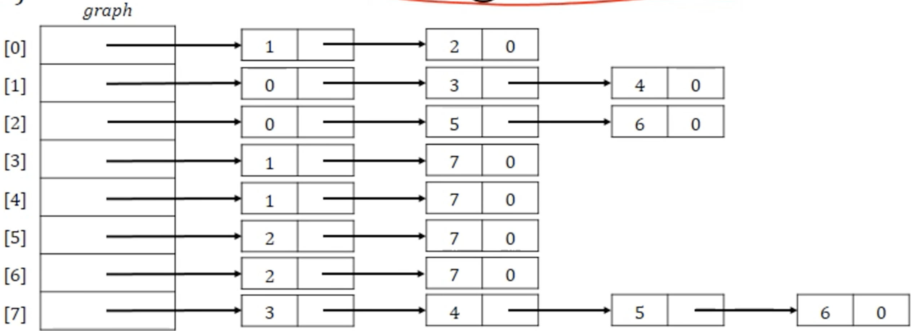

# ❤️ Introduction

<p style="text-align: center;">

</p>

- Graph is a data structure that represent __a network architecture__.
  - Set of nodes, edges

---

## 🧡 Terminologies

|Undirected Graph|Directed Graph||Complete Graph1|Complete Graph2|Weighed Graph|
|-|-|-|-|-|-|
|||||||

|💖|Term|Discription|
|-|-|-|
|1.|__Node(Vertex)__|ex) $V=\{S,L,R,M\}$|
|2.|__Edge(Arc)__|a pair of nodes</br>ex) $E=\{(S,L),(L,M),(L,R),(R,S)\}$|
|3.|__Subgraph__|a graph $G=V'(\subset V) + E'(\subset E)$|
|4.|__Path</br>Simple Path__|a sequence of nodes from a to b</br>a path that has no repeated vertex|
|5.|__Cycle graph__|a graph that has at least one a path that starts and ends with the same vertex.|
|6.|__Connected Component__|An undirected graph $C$ is called __a connected component__ of the undirected graph $G$ if </br>1) $C$ is a subgraph of $G$; </br>2) $C$ is __connected__; </br>3) __no connected__ subgraph of $G$ has $C$ as a subgraph and contains vertices or edges that are not in $C$|
|7.|__Strongly Connected Component__|a graph that every two vertex $a,b$ has two (simple) paths ${(a,b)=a→b, (b,a)=b→a}$|
|8.|__In-degree</br>Out-degree__|__In-degree/Out-degree__ is the number of edges coming-into/going-out-from v, respectively.|
|9.|__Adjacency__|Two edges are called __adjacency__ if they are incident with a common vertex.|

---

## 💛 Representation

### 👉 A graph

|Graph|Adjacency Matrix|Adjacency List|
|:-:|-|-|
||||
|-|<b style="color:red;">- self-edge, self-loop, multi-graph is not permitted</b></br>- Because a set $G, E$ doesn't have same element</br>- Upper triangle, lower triangle are symetric||

### 👉 A weighted graph

|Weighted Graph|Adjacency Matrix|Adjacency List|
|:-:|-|-|
||||
|-|<b style="color:red;">self-edge, self-loop, multi-graph is not permitted</b></br>Because a set $G, E$ doesn't have same element</br>- Upper triangle, lower triangle are symetric||

---

## 💚 Operations



### 👉 DFS(Depth First Search)


```C
void dfs(int v){
    nodePointer w;

    visited[v] = TRUE;
    printf("%5d", v);

    for(w = graph[v]; w; w=w->link)
        if(!visited[w->vertex])
            dfs(w->vertex);
}
```

### 👉 BFS(Breath First Search)


```C
void bfs(int v){
    nodePointer w;
    front = rear = NULL;

    // visit 'v' first
    printf("%5d", v);
    visited[v] = TRUE;

    addQ(v);
    while(front){
        v = deleteQ();
        for(w=graph[v];w;w=w->link){ // Search Breath First
            if(!visited[w->vertex]){
                printf("%5d", w->vertex);
                addQ(w->vertex);
                visited[w->vertex] = TRUE;
            }
        }
    }
}
```

## 💙 Application

- Minimum cost spanning tree
  - Kruskal's algorithm
  - Prim's algorithm
  - Sollin's algorithm

- Stortest path
  - Dijkstra algorithm