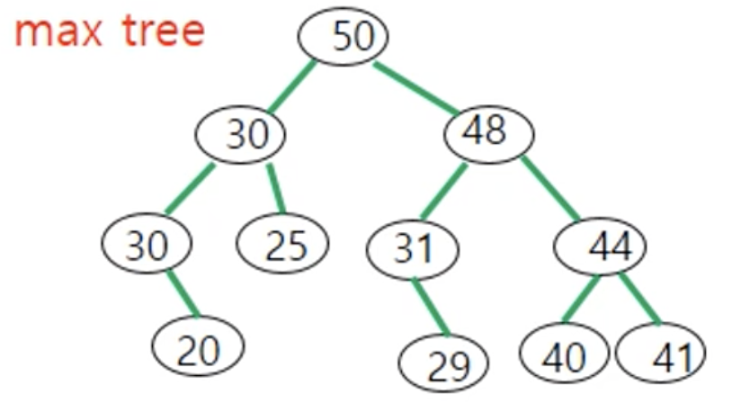
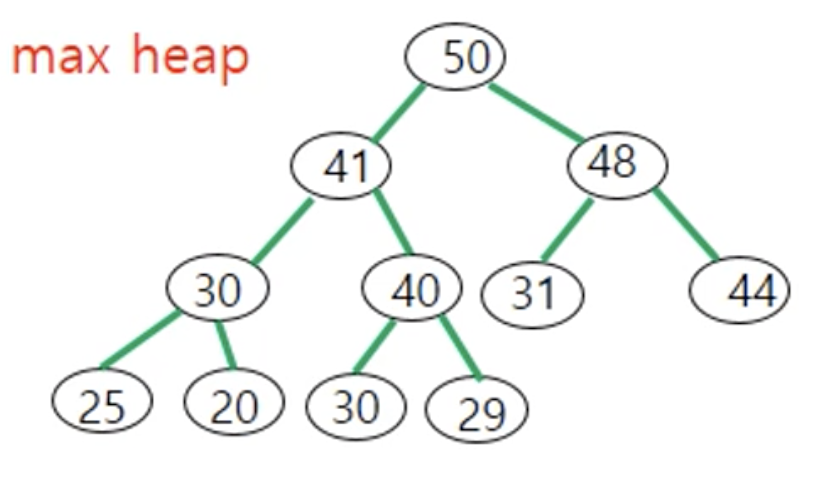
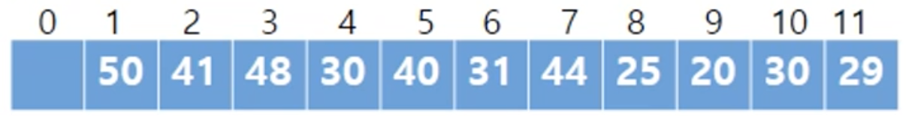
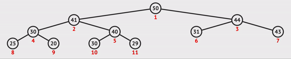
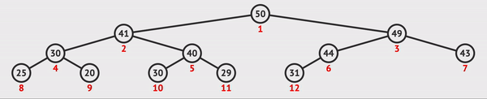

# ❤️ Introduction


- Hospital emergency queue or Work flow in factory to manufacture products are examples of ___Priority Queue___
  - ex) [Samsung SDS - _MES_](https://youtu.be/0qEeSImNXFo)

- ___Priority Queue___ is the queue whose elements are __with priorities__

- A max(min) tree and ___a max(min) heap___ are specific case of ___priority queue using (binary) tree___.

|Max tree|Max heap|
|-|-|
|||

💖 ___A max(min) tree___ is a tree in which the key value in each node is __no smaller(larger)__ than the key values in it children (if any).


---

## 🧡 ADT (of max(min) heap)

💖 __Definition__ : ___A max(min) heap___ is a ${\color{red}{complete -binary-tree}}$ that is also __a max(min) tree__, which means 'Max(min) Heap property' or 'requirements'.

|💖|operation|discription|
|-|-|-|
|1.|___insert(v)</br>(enequeue)___|insert the data ___v___ into max heap ___(at the rightmost leaf node)___ , maintaining ___Max(min) Heap requirements___|
|4.|___delete()</br>(dequeue)___|remove the data at the most priority ___(at the root)___ and return the removed data, maintaining ___Max(min) Heap requirements___|

---

## 💛 Representation

- Array representation is proper
  - Underflow doesn't occcur because max(min) heap is ___a complete binary tree___

|💖|Max heap|
|-|-|
|__Tree__||
|__Array__||

- Each node has a key and other fields
- Access to node in ___A[$i$]___ [(link)](./BinaryTree.md#-representation-of-binary-tree)
  - Left child : A[$2i$]
  - Right child : A[$2i+1$]
  - Parent : A[$\lfloor{i/2}\rfloor$]

```C
typedef struct {
    int key;
    /* other fields */
} element;
element heap[MAX_ELEMENTS];
int n = 0; // number of elements in the heap
```

</br>

### 💖 Operations

#### 👉 1. ___insert(v) (enequeue)___

- Time complexity : ___$O(h) = O(log n)$___

1️⃣ Insert the '___v___' into the new rightmost leaf node ___N___.
2️⃣ Locate '___v___' <b style="color: blue">right position</b> along the path from ___N___ to ___root___.



```C
void push(element item, int *n){
    /* insert 'item' into a max heap of current size 'n' */
    int i;
    if(HEAP_FULL(*n)){
        prtinf("The heap is full.\n");
        return;
    }

    i = ++(*n); // plus one to size of heap
    while ( (i!=1) && (item.key > heap[i/2].key) ){
        // Replace child('i') with parent
        // until 'i' is not root position, and parent of 'i' is larger than 'key of item'.
        heap[i] = heap[i/2];
        i /= 2;
    }

    // insert 'item' into right position 'i'
    heap[i] = item;
}
```


#### 👉 2. ___delete(v) (deequeue)___

- Time complexity : ___$O(h) = O(log n)$___

1️⃣ Delete the key in ___the root___
2️⃣ Set the key of root to the key of rightmost leaf node ___N___
3️⃣ Delete ___N___
4️⃣ <b style="color:red">Adjust</b> the tree to maintain the heap requirements



```C
element pop(int *n){
    /* delete element with the highest key from the heap */
    int parent = 1;
    int child = 2;
    element item, temp;

    if(HEAP_EMPTY(*n)){
        printf("The heap is empty.\n");
        return NULL;
    }

    // save value of the root
    item = heap[1];

    // delete and set the key of root to the key of rightmost leaf node N
    heap[1] = heap[(*n)];

    // delete N and adjust the tree
    adjust(heap, 1, --(*n));

    return item;
}
```

```C
void adjust(element a[], int root, int n){
    int child, rootkey;
    element temp;

    // save value of the root
    temp = a[root];
    rootkey = a[root].key;
    child = 2*root;

    while(child <=n) {
        // choose larger child
        if( (child < n) && (a[child].key < a[child+1].key) )
            child++;

        // if the tree satisfies the heap requirements, stop algorithm
        // '=' means that assumption is "there could be node having the same key"
        // if not, versus
        if(rootkey >= a[child].key) {
            break;
        }
        else {
            // update the parent
            a[child/2] = a[child];
            // and down to next level
            child *= 2;
        }
    }
    // stop algorithm and insert the saved data into the right position
    a[child/2] = temp;
}
```

---

## 💛 Applications

- [Heap Sort](../Algorithm/Sort.md#heap-sort)