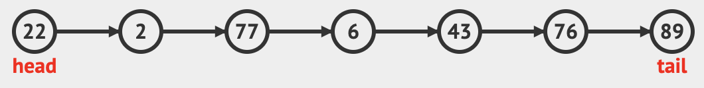
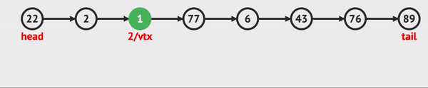
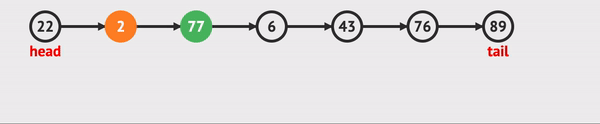

# ❤️ Introduction



- Alternative to Array
  - List can solve the problem of overflow and underflow.
- ___Linked List___ is consisting of a group of vertices (nodes) which together represent a sequence.
  - Each vertex(node) is composed of 'a data' and 'a reference (link)' to the next vertex in the sequence.

---

## 🧡 ADT

- List is a sequence of items/data where positional order matter {a0, a1, ..., aN-2, aN-1}.

1. ___get(i)___ — a trivial operation, return ai
2. ___search(v)___ — decide if item/data v exists, return its index or not a non existing index -1)
3. ___insert(i, v)___ — insert item/data v at the after node of position/index i, potentially shifting the items from [i..N-1] to their right to make a space,
4. ___delete(i)___ — remove item at position/index i, potentially shifting the items from [i+1..N-1] to their left to close the gap.

---

## 💛 Representations

<details>

<summary>C (node, search, insert, delete)</summary>

### 0. Node

- self-referential structure

``` C
typedef struct node *listPointer;
typedef struct node {
    // declaration of data fields
    listPointer link;
};
```

### 1. search(v)


- Looping through links

``` C
for(p = L; p != NULL; p = p->link)
    if(p->data == v)
        return p;
```

### 2. insert(i, v)



- Needed preceding nodes

``` C
void insert(listPointer *first, int i, Data v) {
    listPointer temp;
    listPointer x = get(i-1);
    MALLOC(temp, sizeof(*temp));
    temp->data = v;

    if(*first){
        temp->link = x->link;
        x->link = temp;
    }
    else{
        temp->link = NULL;
        *fisrt = temp;
    }
}
```

### 3. delete(i)



- Needed preceding node

``` C
void delete(listPointer *first, listPointer trail, int i){
    /* trail is the preceding node */
    listPointer x = get(i);
    if(trail){
        trail->link = x->link;
    }
    else{
        *first = (*first)->link;
    }
    free(x);
}
```

- Calling example

  - delete first(head)

    ``` C
    delete(&first, NULL, first);
    ```

  - delete otherwise

    ``` C
    delete(&first, y, y->link);
    ```

</details>

---

## 💚 Applications

- [(Linked) Stack](./Stack.md#-representations)

- (Linked) Queue

- Polynomial representation

---

## 💙 Variations

- LinkedList with a header node

- Circularly LinkedList

- Doubly LinkedList
</br>

- These could be combined each other.

  - ex) Doubly, Circularly LinkedList with a header node

