# ❤️ Introduction

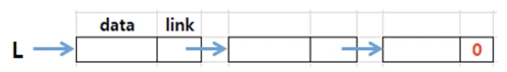

- With singlely linked list, we can't access the preceding node.

- Plus, we have to write extra codes handling the case where the list is empty or at specific target nodes.

---

## 🧡 Variations of LinkedList

1. ___LinkedList with a header node___
2. ___Circularly LinkedList___
3. ___Doubly LinkedList___
4. ___Combination___

---

## 💛 Description

### 1. LinkedList with a header node

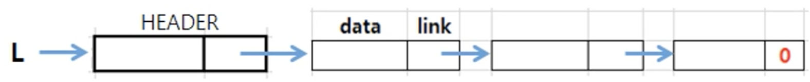

- list starts with a dummy node

- a dummy node could store some information about the list at a header (node)

💖 ___`isEmpty()`___ : list which contains the only header

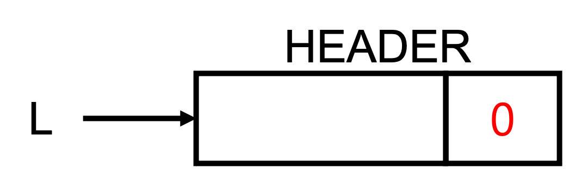


💖 makes it easier to write codes for operations

- ___`insert(i, v)`___
 
    ``` C
    void insert(/*listPointer *first,*/ int i, Data v) {
        listPointer temp;
        listPointer x = get(i-1);
        MALLOC(temp, sizeof(*temp));
        temp->data = v;

    // if(*first){ 

        temp->link = x->link;
        x->link = temp;
     
    // }
    // else{
    //     temp->link = NULL;
    //     *fisrt = temp;
    // }

    }
    ```

- ___`delete(i)`___

    ``` C
    void delete(/*listPointer *first,*/ listPointer trail, listPointer x){
        /* delete x from list */
        /* trail is the preceding node */
        if(trail == x) {
            printf("Deletion of header node not permitted.\n");
            return;
        }

        trail->link = x->link;

    // if(trail){
    //    trail->link = x->link;
    // }
    // else{
    //    *first = (*first)->link;
    // }

        free(x);
    }
    ```

### 2. Circularly LinkedList

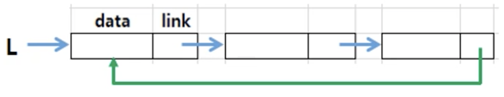

- The last node links to the first node

💖 `Time complexity issue` - Insert a node at the front

- needed to access to the last node's link

- Time complexity : ___O(n)___

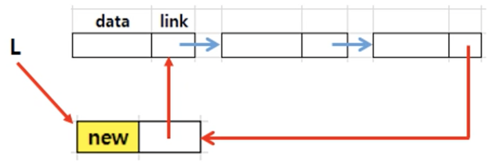

- `Solution` : maintain a variable of the last node(tail)

- Time complexity : ___O(1)___

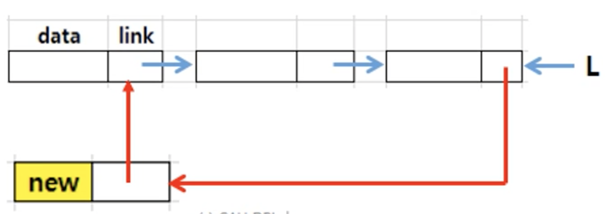

```C
void insertFront(listPointer *last, listPointer node){
    /* 
        Insert a 'node' in the front of the list
        whose last node is 'last'
    */
    if(!(*last)) {
        *last = node;
        node->link = node;
    }
    else {
        node->link = (*last)->link;
        (*last)->link = node;
    }
}
```

### 3. Doubly LinkedList

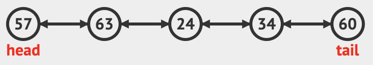

- In the operations of Singly LinkedList ___(insert, delete)___ , we have to know the preceding node of the target node.

- Add a left link field to a node.

💖 `Node`

```C
typedef struct node *nodePointer;
typedef struct node {
    nodePointer llink;
    element data;
    nodePointer rlink;
};
```

### 4. Combinations

#### 4.1 Circularly LinkedList with a header node

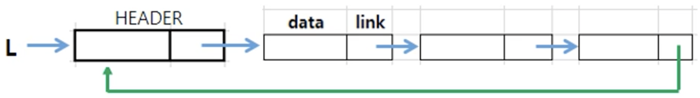

💖 ___`isEmpty()`___ : list which contains the only header

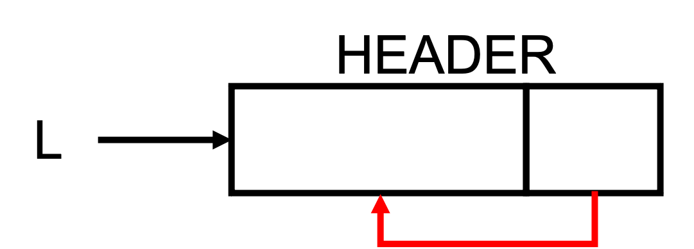

💖 Application : [Polynomial representation](./Polynomial.md)

#### 4.2 Doubly & Circularly LinkedList with a header node

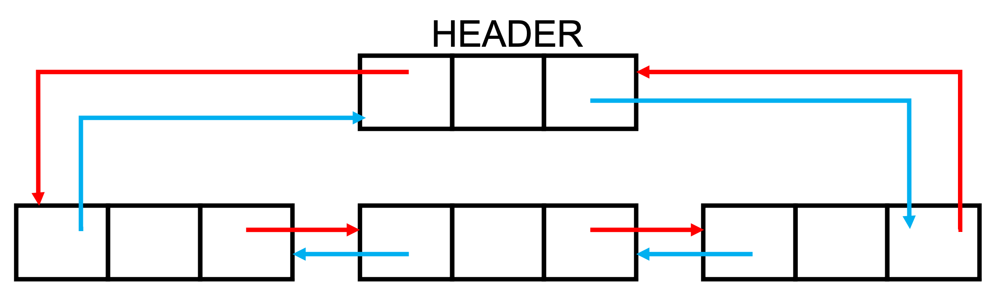

💖 ___`isEmpty()`___ : list which contains the only header

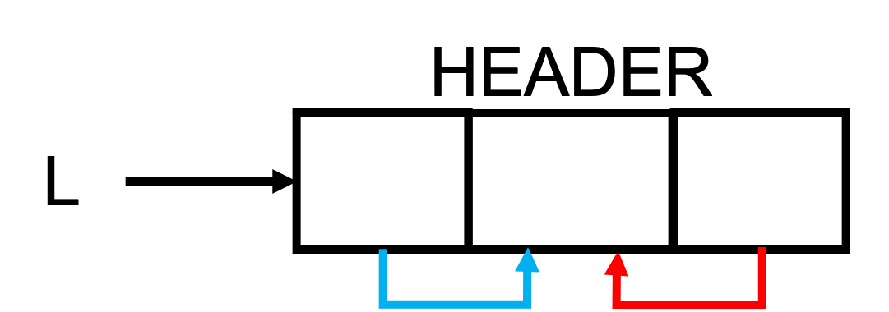

- 💖 ___`Insert(i, v)`___

    - the order of codes is important

    ```C
    void dinsert(nodePointer node, nodePointer newnode){
        newnode->rlink = node->rlink;
        newnode->llink = node;
        node->rlink->llink = newnode;
        node->rlink = newnode;
    }
    ```
- 💖 ___`Delete(i)`___

    ```C
    void ddelete(nodePointer node, nodePointer deleted){
        if(node == deleted)
            printf("Deletion of header node not permitted\n");
        else {
            deleted->llink->rlink = deleted->rlink;
            delete->rlink->llink = deleted->llink;
            free(deleted);
        }
    }
    ```