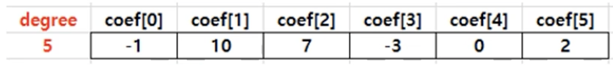
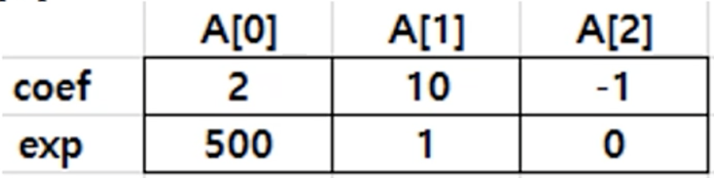
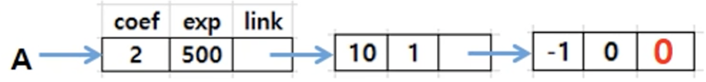
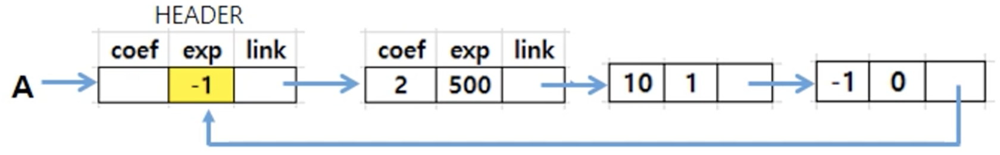
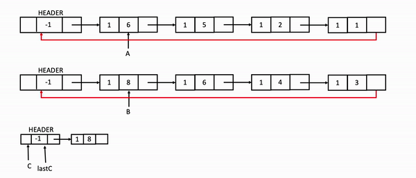

# ❤️ Introduction

$$ A(x)=2x^5-3x^3+7x^2+10x-1 $$

- How can we represent a mathmatical polynomial in data structure?

---

## 🧡 ADT

- Objects : a set of $<e_i, a_i>$ consisting of $P(x)=a_1x^{e_1}+...+a_nx^{e_n}$

- $a_i$: 'Coefficient', $e_i$: 'Exponential', $e_i$ is a zero or a natural number larger than a zero.

|💖| operations | discription |
|-|-- | -- |
|1.| ___zero()___ | return $p(x)=0$ |
|2.|___isZero(poly)___|return true if ___poly___ equals $0$ otherwise false|
|3.| ___coef(poly, exp)___| return $a_i$(coef) satisfying $a_ix^{exp}$ in ___poly___|
|4.| ___leadExp(poly)___ | return the degree of ___poly___ |
|5.| ___attach(poly, coef, expon)___ | return a polynomial attached $coef*x^{expon}$ to ___poly___, if a term with $x^{expon}$ already exist in ___poly___ return _error_|
|6.| ___remove(poly, expon)___ | return a polynomial removed $a_i*x^{expon}$ from ___poly___, if not a term with $x^{expon}$ exist in ___poly___ return _error_
|7.| ___add(poly1, poly2)___ | return a polynomial added ___poly1___ to ___poly2___
|8.| ___mult(poly1, poly2)___ | return a polynomial multiplied ___poly1___ to ___poly2___

---

## 💛 Representations

1. Coefficients with degree
    - Using Array
2. List of Terms
    - Using Array
    - Using LinkedList
3. ___add(poly1, poly2)___
    - Using Array of Terms
    - Using Circularly LinkedList with a header node

### 👉 1. Coefficients with degree

#### 1.1 Array of Coefficients with degree




- `Term`

    ```C
    int coef[X+1];
    ```

- `Polynomial`

    ```C
    typedef struct {
        int degree;
        int coef[X+1];
    } Polynomial;
    ```

- `Example`

    ```C
    Polynomial A;
    A.degree = 5;
    A.coef[5] = 2; ,..., A.coef[0] = -1;
    ```

### 👉 2. List of Terms

#### 2.1 Array of Terms



- can solve the waste of memory
  - ex) $A(x)=2x^{500}+10x-1$

- `Term`

    ```C
    typedef struct {
        int coef;
        int exp;
    } Term;
    ```

- `Polynomial`

    ```C
    typedef struct {
        int num_terms;
        Term term[MAX_TERMS];
    } Polynomial;
    ```

- `Example`

    ```C
    Polynomial A;
    A.num_terms = 3;
    A.term[0].coef = 2; A.term[0].exp = 500;
    A.term[1].coef = 10; A.term[1].exp = 1;
    A.term[2].coef = -1; A.term[2].exp = 0;
    ```

#### 2.2 Using LinkedList



- `Polynomial`
    ```C
    typedef struct polyNode *polyPointer;
    typedef struct polyNode{
        int coef;
        int exp;
        polyPointer link;
    };
    ```

### 👉 3. ___add(poly1, poly2)___

- `Sudo Code`

```C
// d = a + b
d = zero()
while (! isZero(a) && ! isZero(b)) do {
    switch COMPARE(leadExp(a), leadExp(b)) {
        case -1:
            d = attach(d, coef(b, leadExp(b)), leadExp(b));
            b = Remove(b, leadExp(b));
            break;
        case 0:
            sum = coef(a, leadExp(a)) + coef(b, leadExp(b));
            if(sum)
                d = attach(d, sum, leadExp(a));
                // or just skip
            a = remove(a, leadExp(a));
            b = remove(b, leadExp(b));
            break;
        case 1:
            d = attach(d, coef(a, leadExp(a)), leadExp(a));
            a = remove(a, leadExp(a));
            break;
    }
}
INSERT ANY remaining terms of a or b INTO d.
```

#### 3.1 Using Terms of Array

#### 3.2 Using Circularly LinkedList with a header node



- Circularly LinkedList with a header node
  - Exponent in the header = $-1$

- ___cpadd(poly1, poly2)___
  - 
  - [code in C](./PolynomialAdditionUsingList.c)