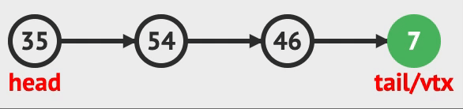

# ❤️ Introduction

<p align="center">
 
</p>

- Special case of ordered list

- First-In-First-Out (FIFO) list


## 🧡 ADT

- A particular kind of ADT in which the main operations on the collection are ***enqueue(or addQ), dequeue(or deleteQ).***

- Objects are finite ordered list which contains elements more than zero.
- The items in the collection are kept __in order__.

1. ___enequeue(item)___ : the addition of items to the back position(REAR)
2. ___dequeue()___ : removal of items from the front position(FRONT), return removed item
3. ___isEmpty()___ : return _true_ if queue is empty, otherwise _false_
4. ___isFull()___ : return _true_ if queue is full, otherwise _false_

## 💛 Representations

<!-- C start -->
<details>

<summary>C (Array, LinkedList) </summary>

<!-- Array start -->
<details>
<summary>With Array</summary>

- With Array, Queue implementation needs **circular** solution.

<!-- Array end -->
</details>

<!-- LinkedList start -->
<details>
<summary>With LinkedList</summary>

### 0. Queue

```C
typedef struct {
    int key;
    /* other fields */
} element;
```

```C
typedef struct queue *queuePointer;
typedef struct queue {
    element data;
    queuePointer link;
};
queuePointer front;
queuePointer rear;
```

### 1. enqueue(v)



```C
void enqueue(element item){
    queuePointer temp;
    MALLOC(temp, sizeof(*temp));
    temp->data = item;
    temp->link = NULL;
    
    if(front)
        rear->link = temp;
    else
        front = temp;
    rear = temp;
}
```

### 2. dequeue()

- Needed the variable to save dequeued data


```C
element dequeue(){
    stackPointer temp = front;
    element item;
    
    if(!temp)
        return isEmpty();
    
    item = temp->data;

    front = temp->link;
    free(temp);
    return item;
}
```

</details> 
<!-- LinkedList end -->

<!-- C end -->
</details>


## 💚 Applications

- Maze Problem

- Postfix Calculator

  - Evaluation
  - Conversion
