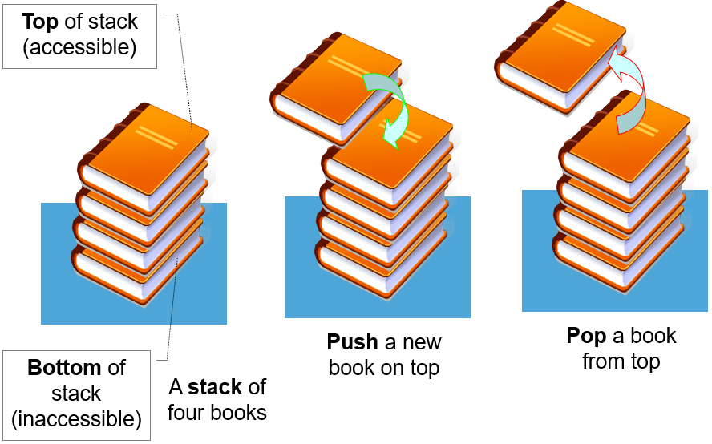

# ❤️ Introduction

<p align="center">
 
</p>

- Special case of ordered list

- Last-In-First-Out (LIFO) list


## 🧡 ADT

- A particular kind of ADT in which the main operations on the collection are ___Push, Pop___.

- objects are finite ordered list which contains elements more than zero.

1. ___push(item)___ : push a new item only to the head(top, stack pointer) (insert at head)
2. ___pop()___ : pop existing item only from the head(top, stack pointer) (remove from head), return removed item
3. ___isEmpty()___ : return _true_ if stack is empty, otherwise _false_
4. ___isFull()___ : return _true_ if stack is full, otherwise _false_

## 💛 Representations

<!-- C start -->
<details>

<summary>C (Array, LinkedList) </summary>

<!-- Array start -->
<details>
<summary>With Array</summary>

<!-- Array end -->
</details>

<!-- LinkedList start -->
<details>
<summary>With LinkedList</summary>

### 0. Stack

```C
typedef struct {
    int key;
    /* other fields */
} element;
```

```C
typedef struct stack *stackPointer;
typedef struct stack {
    element data;
    stackPointer link;
};
stackPointer top;
```

### 1. push(v)


```C
void push(element item){
    stackPointer temp;
    MALLOC(temp, sizeof(*temp));
    temp->data = item;

    temp->link = top;
    top = temp;
}
```

### 2. pop()

- Needed the variable to save poped data


```C
element pop(){
    stackPointer temp = top;
    element item;
    
    if(!temp)
        return isEmpty();
    
    item = top->data;

    top = temp->link;
    free(temp);
    return item;
}
```

</details> 
<!-- LinkedList end -->

<!-- C end -->
</details>


## 💚 Applications

- Maze Problem

- Postfix Calculator

  - Evaluation
  - Conversion
