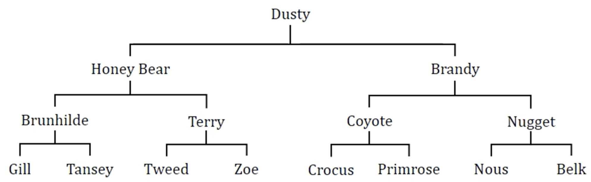
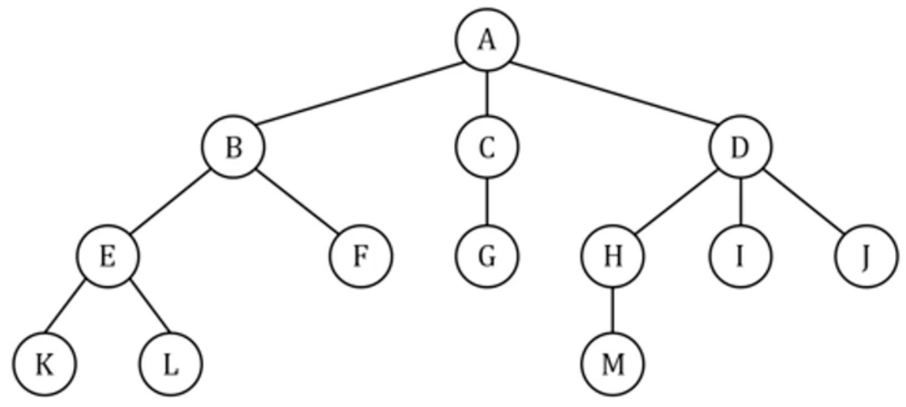
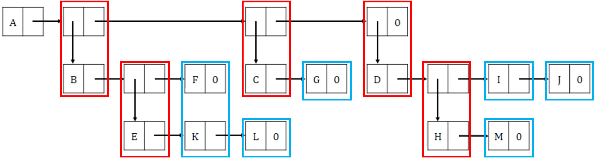
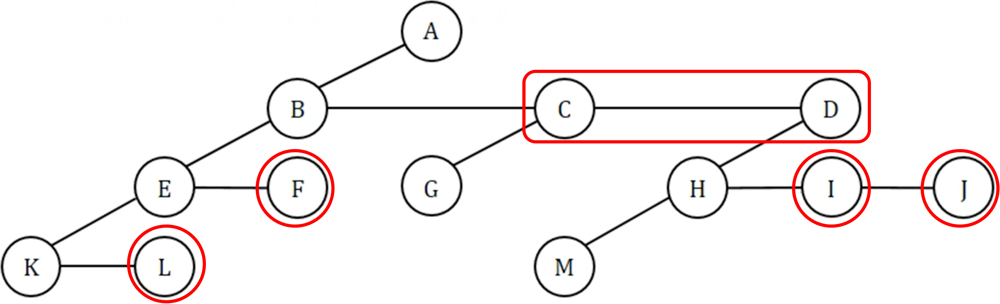
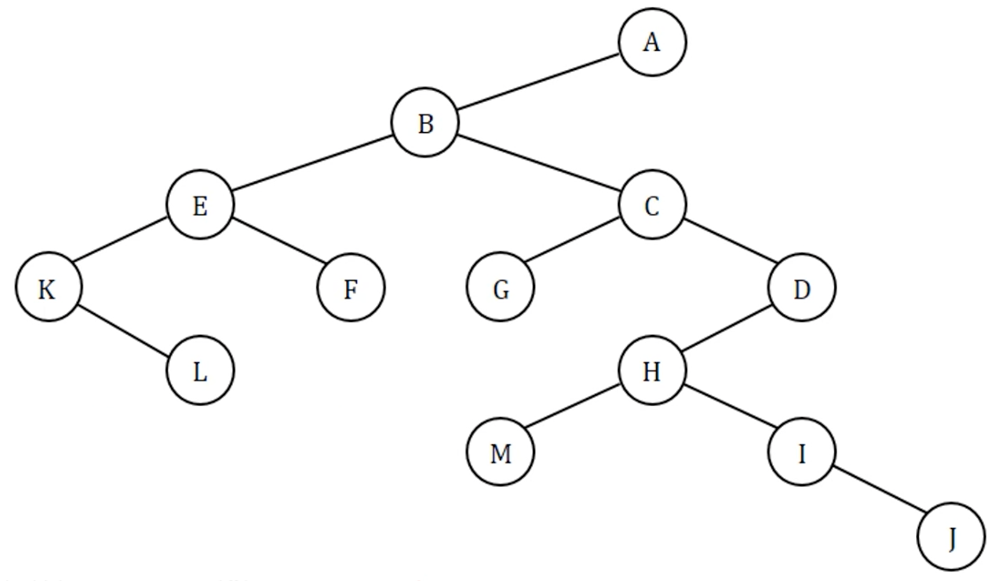

# ❤️ Introduction

- Structure with a set of acyclic connected nodes.

- Tree can represent hierarchy.

- Examples are pedigree chart, lineal chart.

💖 __Definition__ : ___A tree___ is a finite set of __one or more__ nodes such that 
 __(1)__ there is a specially designated node called __the root__ 
 __(2)__ and the remaining nodes are partitioned into $n \geq 0$ disjoint sets {$T_1,...,T_n$}, where each of these sets is ___a tree.___
{$T_1,...,T_n$} are called the __subtrees__ of the root

---

## 🧡 Terminologies

|💖|Term|Disription|
|-|-|-|
|1.|__Node__|contains data and connections to other nodes called edge <ins>Tree's each node has only 1 parent node, except for root</ins>|
|2.|__Root__|The topmost node|
|3.|__Parent__|Node linked to child|
|4.|__Child__|Nodes connected from parent|
|4-1.|__Degree, Fan-out__|The number of children|
|5.|__Subtree__|A tree that has the child as root|

|💖|Term|Disription|
|-|-|-|
|6.|__Sibling__|Nodes that have same parent|
|7.|__Ancestor__|Nodes reachable by repeated proceeding from child to parent|
|8.|__Descendant__|Nodes reachable by repeated proceeding from parent to child|
|9.|__Leaf__|Node that has no child|
|10.|__Forest__|A set of trees|

|💖|Term|Disription|
|-|-|-|
|11.|__Path__|Sequence of nodes from node X to node Y|
|12.|__Level__|The number of edges along the path from itself to the root|
|13.|__Height, Depth__|Maximum number of Levels|

---

## 💛 Representation of Tree

- To represent a tree, we need to allocate danamic space memory

#### 💖 List Representation

- Non-leaf nodes have ___tag fields nodes___
- ___Leaf nodes___ are connected to node's right link

#### 💖 Left-Child Right-Sibling Representation

#### 💖 Degree-two tree Representation

- Rotate $45^{\circ}$ clockwise siblings of Left-Child Right-Sibling representation

---

## 🖤 Application

- [Binary Tree](./BinaryTree.md)
- [Binary Search Tree](./BinarySearchTree.md)
- [Heap](./Heap.md)