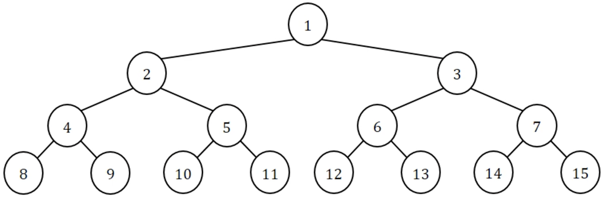
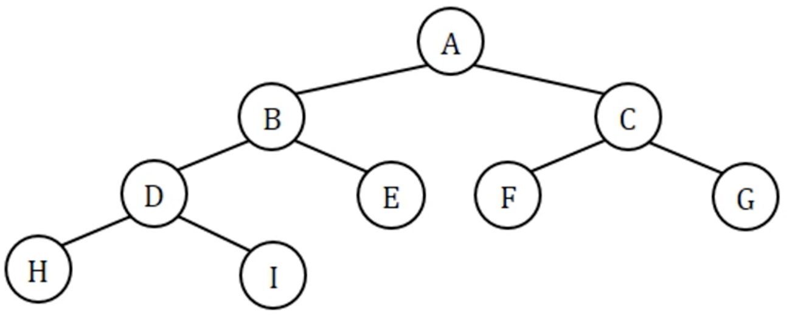
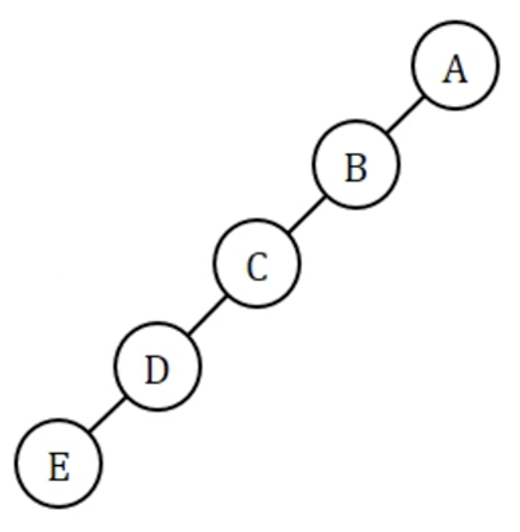

# ❤️ Introduction


- Structure with a set of acyclic connected nodes.

- Tree can represent hierarchy.

- Examples are pedigree chart, lineal chart.

💖 __Definition__ : ___A tree___ is a finite set of __one or more__ nodes such that 
__(1)__ there is a specially designated node called __the root__ 
__(2)__ and the remaining nodes are partitioned into $n \geq 0$ disjoint sets {$T_1,...,T_n$}, where each of these sets is ___a tree.___
{$T_1,...,T_n$} are called the __subtrees__ of the root

---

## 🧡 Terminologies

|💖|Term|Disription|
|-|-|-|
|1.|__Node__|contains data and connections to other nodes called edge</br><ins>Tree's each node has only 1 parent node, except for root</ins>|
|2.|__Root__|The topmost node|
|3.|__Parent__|Node linked to child|
|4.|__Child__|Nodes connected from parent|
|4-1.|__Degree, Fan-out__|The number of children|
|5.|__Subtree__|A tree that has the child as root|

|💖|Term|Disription|
|-|-|-|
|6.|__Sibling__|Nodes that have same parent|
|7.|__Ancestor__|Nodes reachable by repeated proceeding from child to parent|
|8.|__Descendant__|Nodes reachable by repeated proceeding from parent to child|
|9.|__Leaf__|Node that has no child|
|10.|__Forest__|A set of trees|

|💖|Term|Disription|
|-|-|-|
|11.|__Path__|Sequence of nodes from node X to node Y|
|12.|__Level__|The number of edges along the path from itself to the root|
|13.|__Height, Depth__|Maximum number of Levels|

---

## 💛 Representation of Tree


---

## 💚 Binary Tree

- ___N-ary tree___ : A tree that each node has at most n-child nodes.



- ___Binary Tree___ : A tree that each node has at most 2 children.

- ___Full Binary Tree___ : A tree that every node has 2 children except for the leaves.
  - Number of nodes : $2^h-1$



- ___Complete Binary Tree___ : A tree __(1)__ satisfying ___Full Binary Tree___ by 'Level $h-2$', __(2)__ and at 'Level $h-1$' possible to remove only from the rightmost leaf.
  - Number of nodes : $2^{h-1} \leq n \leq 2^h-1$



- ___Skewed Binary Tree___ : A tree that has only left or right descendant.
  - Number of nodes : $h$

### 👉 Equality between the number of nodes($n$) and height($h$)

- ___Full Binary Tree___
  - $h=log_2(n+1)$, $n=2^h -1$
  - $h=1+log_2{n_0}$ ($n_0$ is $n$ of __leaves__)

- ___Complete Binary Tree___
  - $h=\lfloor log_2n \rfloor +1$
  - $h=\lceil log_2{n+1} \rceil$
  - $2^{n-1} \leq h \leq 2^h-1$

- ___Skewed Binary Tree___
  - $h=n$

- ___Arbitary Binary Tree___
  - $h \leq n \leq 2^h-1$ (h is given)
  - $log_2{(n+1)} \leq h \leq n$ (n is given)

---

## 💙 Representation of Binary Tree

---

## 💜 Operations of Binary Tree

|💖|operation|discription|
|-|-|-|
|1.|___preorder(root)___|traveral of ___root___ in order of {$root, leftChild, rightChild$}|
|2.|___inorder(root)___|traveral of ___root___ in order of {$leftChild, root, rightChild$}|
|3.|___postorder(root)___|traveral of ___root___ in order of {$leftChild, rightChild, root$}|
|4.|___level-order(root)___|traversal of ___root___ level by level, where ___root___ is visited first,</br>followed by its direct childs and siblings second, </br>its grandchild nodes and their siblings third, etc., </br>until all nodes have been traversed.|
|5.|___copy(root)___|return a pointer of root to an exact copy of original ___root___|
|6.|___equal(root1, root2)___|return _false_ if ___root1___ and ___root2___ are not equal, otherwise return true|

### 👉 0. Node

```C
typedef struct node* treePointer;
typedef struct node{
    treePointer left;
    Data data;
    treePointer right;
};
```

### 👉 1. ___preorder(root)___

```C
void preorder(treePointer ptr){
    if(ptr){
        printf("%d", ptr->data);
        preorder(ptr->leftChild);
        preorder(ptr->rightChild);
    }
}
```

### 👉 2. ___inorder(root)___

- recursive traversal

```C
void inorder(treePointer ptr){
    if(ptr) {
        inorder(ptr->leftChild);
        printf("%d", ptr->data);
        inorder(ptr->rightChild);
    }
}
```

- Iterative inorder traversal

```C
void iterInorder(treePointer node){
    int top = -1;
    treePointer stack[MAX_STACK_SIZE];

    for(;;) {
        // push all left descendant of the node(iter) to stack
        for(; node; node=node->leftChild)
            push(node);
        
        node = pop();

        // if stack is empty, stop traversal
        if(!node)
            break;

        // visit poped node, and iter moves to right child node poped node;
        printf("%d", node->data);
        node = node->rightChild;
    }
}
```

### 👉 3. ___postorder(root)___

```C
void postorder(treePointer ptr){
    if(ptr) {
        postorder(ptr->leftChild);
        postorder(ptr->rightChild);
        printf("%d", ptr->data);
    }
}
```

### 👉 4. ___level-order(root)___

```C
void levelOrder(treePointer ptr){
    int front = reat = 0;
    treePointer queue[MAX_QUEUE_SIZE];
    
    if(!ptr)
        return;

    addQ(ptr);

    for(;;){
        ptr = deleteQ();
        if(ptr){
            printf("%d", ptr->data);
            if(ptr->leftChild)
                addQ(ptr->leftChild);
            if(ptr->rightChild)
                addQ(ptr->rightChild);
        }
        else
            break;
    }
}
```

### 👉 5. copy(root)

```C
treePointer copy(treePointer original){
    treePointer temp;
    if(original) {
        temp = (treePointer)malloc(sizeof(*temp));
        temp->leftChild = copy(original->leftChild);
        temp->rightChild = copy(original->rightChild);
        temp->data = original->data;
        return temp;
    }
    return NULL;
}
```

### 👉 6. equal(root1, root2)

```C
int equal(treePointer first, treePointer second){
    return 
    ( 
        (!first && !second) || 
        (
            first && second && first->data == second->data &&
            equal(first->leftChild, first->leftChild) &&
            equal(first->rightChild, first->rightChild)
        ) 
    );
}
```

---

## 🖤 Application

- Binary Search Tree